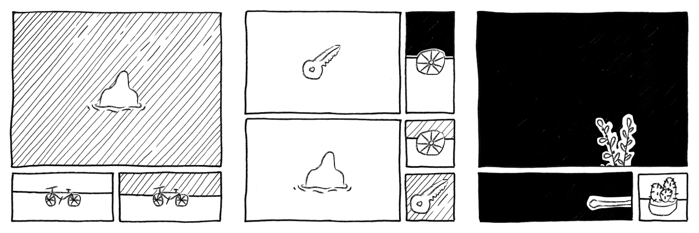

# kosmotomi-comic
A Processing app to generate random comics.

## Getting Started

### Basics
Run `build.pde` in [Processing 3](https://processing.org/download/).

While the app is running, press `r` to randomize your comic. This will change the layout as well as the selected images.  
Click any panel to change the panel image without altering the comic layout.

To save your image press the `s` key.  
Images are saved to the `output` folder.

### Adding Images
Images should be saved as transparent PNG files in the `images` folder.  
Each image needs to have a identically sized and named outline image saved to the `imageOutlines` folder. These white outlines are placed behind images when a black panel background is used.

The default resolution for both input and output is 600 ppi. Panels are sized in increments of 0.75 inches. So a 1x1 image would be 450 x 450px.  
The image resolution can be adjusted via the Config file.

Each image needs to have an entry in the `assets.csv` file. The minimum required data is the filename, but you can also specify a focal area (in pixels, based on a 600 ppi image), minimum number of panels for width and height, which side of the panel (if any) the image should be anchored to, whether or not the image uses a horizon line, and minimum and maximum y positions for the horizon line (in pixels, based on a 600 ppi image).

### Customization
Customize the comic features by editing variables in the `Config.pde` file.  
You can create and customize instances of `Config` to make it easier to switch between versions (for quickly changing resolution and margins for example).

If you want panels larger than 4x4, you'll need to draw your own frames for them.

## License

This project is licensed under the Unlicense - see the [LICENSE.md](LICENSE.md) file for details.
